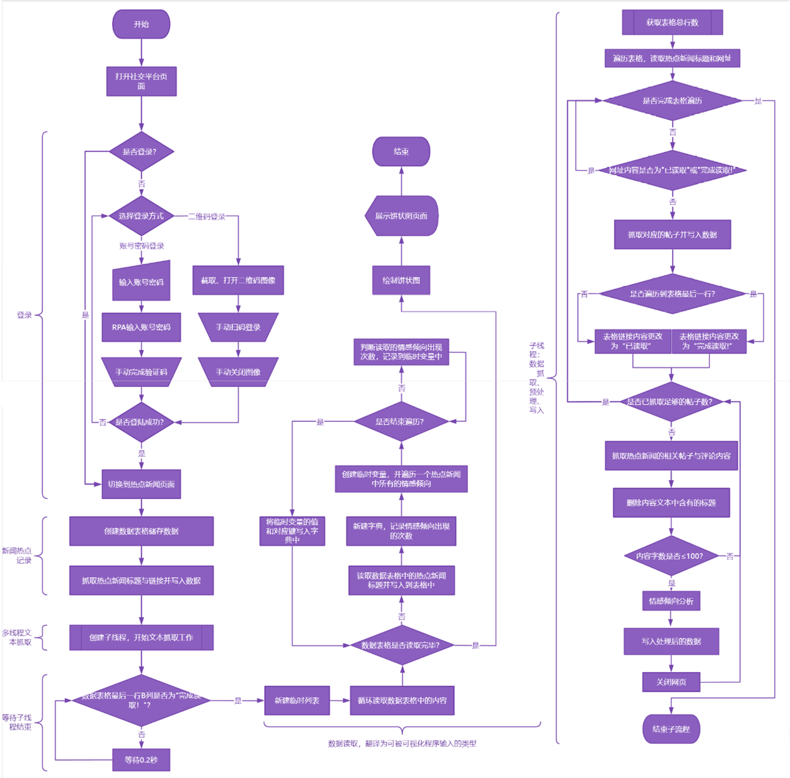

# 仓库介绍

2024年海南省大学生RPA+AI创新挑战赛 省级二等奖项目 **《AI驱动的社交媒体热点追踪与分析系统》**  

# 如何下载

项目文档/PPT/代码截图都在项目源码的文件夹中,请根据分类下载。

# 图片展示

## 项目流程图

**更多内容请见仓库文件**

# 文件目录

- ## *Code-Pics*  各个源码的截图
  - *0-Main* [主流程](Code-Pics/0-Main.png)
  - *1-Login* [登陆界面](Code-Pics/1-Login.png)
  - *2-HotspotRecords* [热点记录](Code-Pics/2-Hotspot_Records.png)
  - *3-Multi-threaded Data Grabbing* [多线程数据抓取](Code-Pics/3-Multi-threaded_Data_Grabbing.png)
  - *4-Data Grabbing* [数据抓取](Code-Pics/4-Data_Grabbing.png)
  - *5-Information Processing* [数据处理](Code-Pics/5-Information_Processing.png)
- ## *DOCS* 项目相关文档
  - *Project programme documentation* [项目方案文档](DOCS/Project_Programme_Documentation.docx)
  - *Showcase Speech* [项目展示演讲稿](DOCS/Showcase_Speech.docx)
- ## *PPTS* 项目相关演示文稿
  - *Project Presentation* [项目演示PPT](PPTS/Project_Presentation.pptx)
  - *Simplified Project Presentation* [简化项目演示PPT(录制视频用)](PPTS/Simplified_Project_Presentation.pptx)
- ## *Pics* 项目相关图片
  - *Main Thread Process Risk and Automation Analysis Table* [主流程风险与自动化流程分析](Pics/Main_Thread_Process_Risk_and_Automation_Analysis_Table.png)
  - *Subthreading Process Risk and Automation Analysis Table* [子流程风险与自动化流程分析](Pics/Subthreading_Process_Risk_and_Automation_Analysis_Table.png)
  - *Main thread step-by-step instructions* [主流程步骤说明](Pics/Main_thread_step-by-step_instructions.png)
  - *Subthreading step-by-step instructions* [子流程步骤说明](Pics/Subthreading_step-by-step_instructions.png)
  - *Program Flow Chart* [项目流程图](Pics/Program_Flow_Chart.png)
